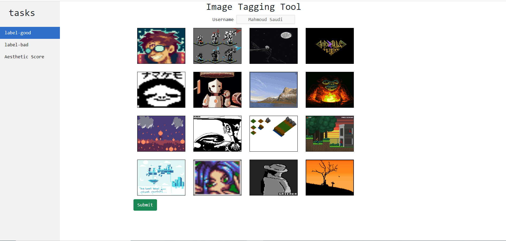

# ImageTaggingTool
> A standalone tool for tagging image datasets. 

## Tool Description

given an image dataset directory and the tag tasks you need to apply for this dataset, the tool runs web UI can be accessed at  http://127.0.0.1:5000 with a grid of images taken from the image directory you have passed to be used for tagging depending on the task you choose, the tagged images metadata can be found in `data_output_directory` in `json` format.


## Installation
All what is needed to start using ImageTaggingTool is to install the dependencies using the command
```
pip install -r src/to/dir/requirements.txt
```

## CLI Parameters

* `images_dataset_directory` _[string]_ - _[required]_ - the root path of the image dataset directory.
* `tag_tasks` _[list]_ - _[required]_ - the tagging tasks/labels to use in the tool, and should be provided as a list. 

* `data_output_directory` _[string]_ - _[required]_ the directory to write the resultant `json` files inside, the `json` files contains the tagged images metadata.

* `dictionary_path` _[string]_ - _[optional]_ path to the dictionary to be used in tagging the `Aesthetic scores` task. 

* `grid_dim` _[int]_ - _[optional]_ -  the dimension of the grid displaying the images, the grid is a square default dim is `4`. 

* `samples_seed` _[int]_ - _[optional]_ -   seed of the pseudo random generator generating the sample images generated to be displayed in the grid, default is `None`. 

## Example Usage

```sh
python src/to/dir/ImageTaggingTool.py --images_dataset_directory='path/to/my-image-dataset' --tag_tasks=[good,bad] --data_output_directory='path/to/output-directory'
```

> Note that if the `data_output_directory` is not created the tool automatically creates it for you. 

Below you can see the shape of the web UI which can be accessed at http://localhost:5000 after running the tool.




<!-- Example Output 
```
finished batch 5 out of 35 batches
finished batch 6 out of 35 batches
finished batch 7 out of 35 batches
finished batch 8 out of 35 batches
finished batch 9 out of 35 batches
finished batch 10 out of 35 batches
finished batch 11 out of 35 batches
```

Each batch is representing a set of images to be previewed in one matrix image and saved in the `output_directory` -->
